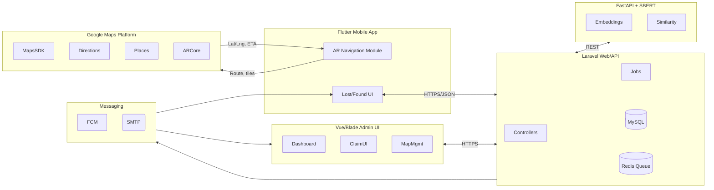

# Google API & Navigation Integration Guide

## 1. Google API Scope, Features, and System Context

### 1.1 What Google APIs We Use for Navigation
- **Maps SDK for Android/iOS** – renders the campus basemap, POIs, and lost/found pin layers inside the Flutter AR module.  
- **Directions API** – returns optimal walking routes between the student’s current GPS fix and a selected destination (e.g., security office, last-known item location).  
- **Distance Matrix API** – estimates travel time/distance for multiple alternative routes so the app can highlight the fastest option or warn when a pickup SLA might be missed.  
- **Places API & Geocoding API** – resolves building names or typed text to latitude/longitude for both mobile navigation and admin-managed location catalogs.  
- **Roads / Snap-to-Road API (optional)** – cleans noisy GPS traces before projecting them into the AR overlay.  
- **ARCore Geospatial API** – anchors 3D navigation cues to real-world coordinates on supported Android devices.

### 1.2 Scope, Limitations, Devices
- **Primary Scope** – GPS-assisted outdoor campus routing, POI lookup, and AR overlays that help students reach collection offices. Google APIs supply geospatial data only; lost/found logic stays in our backend.  
- **Limitations** –  
  - Google’s navigation stack does **not** provide indoor turn-by-turn or floor-level positioning; accuracy drops inside dense buildings.  
  - Requires stable internet plus Google Play Services; mainland China and other restricted regions may block access.  
  - Subject to quota, QPS, and billing constraints; throttling will slow map/routing responses.  
- **Applicable Devices** – Android 8+ phones/tablets with GPS, gyroscope, magnetometer, camera, and ARCore certification for full AR mode; iOS devices via Flutter plugin can show maps/directions but ARCore-specific overlays fall back to 2D.  
- **Non-applicable Devices** – Legacy Android devices without Play Services, desktops without location sensors, or browsers that disallow camera access cannot run AR navigation (they still can view 2D map previews).  
- **Primary Purpose** – Augment the lost-and-found workflow with spatial context: mark drop-off points, guide students to collection offices, and validate where items were reported.

### 1.3 Features & Functions of the Whole System
- **Mobile (Flutter/NavistFind)** – account auth, lost-item posting, found catalog browsing, AI recommendations, claim submissions, notifications, and AR navigation overlays tied to Google Maps data.  
- **Web Dashboard (Laravel)** – admin CRUD for lost/found items, multi-claim resolution, approval workflow, SLA monitoring, analytics, and map management for POIs.  
- **AI Service (FastAPI + SBERT)** – generates embeddings, computes cosine similarity, ranks candidates, feeds both mobile recommendations and admin review queues.  
- **Cross-Cutting Jobs** – Laravel queue workers handle ComputeItemMatches, reminder emails, FCM pushes, and SLA audits.  
- **Notifications** – Firebase Cloud Messaging delivers push to students; Laravel mailers send approval/rejection emails; Google routing timestamps help craft reminder wording (e.g., “15 min walk remaining”).  
- **AR Navigation** – overlays Google-derived routes with device pose to deliver step-by-step campus guidance.

### 1.4 Technologies Used vs. Excluded
- **Included** – Flutter, Dart, Laravel 11/PHP 8, MySQL or MariaDB, Redis queues, FastAPI (Python 3.10), Sentence-BERT, Firebase Cloud Messaging, Google Maps Platform (Maps / Directions / Places / ARCore), Leaflet for admin map previews, Docker for AI service deployment.  
- **Excluded** – Apple MapKit (not needed given Android focus), proprietary indoor-positioning (BLE beacons/UWB), offline map tiles, GraphQL APIs, heavy-weight ML stacks (no transformers training in-production), SMS gateways (email/push only).  

### 1.5 Performance/Reliability Factors
- API quota exhaustion or network latency to Google endpoints causes slow or failed navigation lookups.  
- Poor GPS signal, magnetic interference, or camera occlusions degrade ARCore’s pose estimate.  
- Large influx of lost/found records increases SBERT batch processing time; ensure queue scaling.  
- Admin edits that reopen items trigger AI recomputes; make sure FastAPI service has enough replicas.  
- Outdated Flutter clients without the latest Google API keys will fail to initialize maps.  
- Heavy notification bursts (approvals, reminders) can overlap with routing requests; monitor Firebase and mail throughput.

## 2. System Architecture with Google API Integration

**Flow Explanation**
1. Students interact with the Flutter UI, which calls Laravel APIs for authentication, lost/found CRUD, match retrieval, and claim submission.  
2. When AR navigation is launched, the app fetches POIs (`/api/ar/locations`) from Laravel, then requests live routes from Google Directions; the Maps SDK renders the path while ARCore fuses sensor data for 3D cues.  
3. Posting a lost item triggers Laravel’s `ComputeItemMatches` job, which pushes the payload to the FastAPI SBERT service; similarity scores return to Laravel and are persisted for recommendations.  
4. Admins use the Blade/Vue dashboard to monitor claims, approve matches, and manage POIs; map widgets reuse Google Maps in the browser for consistency.  
5. Notifications and reminders flow through Firebase Cloud Messaging and SMTP; Google ETA data is optionally embedded in reminder content (“5 minutes walk from Library”).  

## 3. Algorithms in Use

### 3.1 SBERT Embedding + Cosine Similarity
- **Problem Solved** – Automatically find likely matches between newly posted lost items and the catalog of found items.  
- **Why Chosen** – Sentence-BERT captures semantic meaning better than keyword search, gives fast inference, and pairs well with cosine similarity for ranking.  
- **How It Works**  
  1. Laravel queues `ComputeItemMatches` whenever a lost/found item is created or updated.  
  2. The job calls FastAPI `/embeddings/generate` with normalized text (title, description, category, location tags).  
  3. FastAPI loads a pre-trained SBERT model and returns a 768-d vector.  
  4. Laravel stores the embedding and requests `/matches/score` to compare against opposite-type items.  
  5. Cosine similarity is computed for each pair; results above threshold are persisted in `item_matches`.  
  6. Flutter fetches matches sorted by score; admins see the same data for approval.  
- **Formula**  
  - `cos_sim(A,B) = (Σ A_i * B_i) / (||A|| * ||B||)` with `||A|| = sqrt(Σ A_i^2)`  
- **Problem Solved By Formula** – Converts textual similarity into a bounded score [−1,1], enabling rank ordering and thresholding.

### 3.2 Category-Weighted Match Ranking
- **Problem Solved** – Different item categories have different false-positive tolerance (e.g., phones vs. notebooks).  
- **Why Chosen** – Simple linear weighting adapts to domain knowledge without retraining SBERT.  
- **How It Works**  
  1. Each category has admin-configured weights for text similarity, location proximity, and metadata overlap (color, brand).  
  2. After cosine similarity is computed, Laravel calculates `score_final = (w_text * cos_sim) + (w_loc * loc_score) + (w_meta * meta_overlap)` where weights sum to 1.  
  3. Items with `score_final >= category_threshold` are surfaced; others remain hidden to avoid noisy recommendations.  
  4. Thresholds are stored in settings; changing them triggers recomputation for affected items.  
- **Formulas**  
  - Weighted score: `score_final = Σ (w_n * metric_n)`  
  - Location sub-score: `loc_score = e^(−d / λ)` where `d` is meters (Haversine) and `λ` is decay constant (e.g., 50 m).  
- **Outcome** – Improves precision on high-value items and reduces alert fatigue for admins.

### 3.3 Claim SLA & Reminder Scheduler
- **Problem Solved** – Prevents approved claims from stalling by escalating when students do not pick up items within 24 hours.  
- **Why Chosen** – Deterministic time-based checks are reliable, lightweight, and easy to audit.  
- **How It Works**  
  1. `MonitorPendingClaimsSlaJob` runs hourly from Laravel’s scheduler.  
  2. For each claim with status `awaiting_collection`, compute `elapsed = now() - approved_at`.  
  3. If `elapsed >= SLA (24h)`, flag the claim, send admin notification, and log in `activity_logs`.  
  4. `SendCollectionReminderJob` runs every 3 days to email the claimant; job stops once `collected_at` is set.  
- **Formulas**  
  - `elapsed_hours = (now - approved_at) / 3600`  
  - `sla_breach = elapsed_hours >= 24`  
  - Reminder cadence uses `next_run = approved_at + n * 72h` for n ∈ ℕ until collected.  
- **Outcome** – Keeps admins proactive, reduces lost inventory, and documents compliance.

### 3.4 Navigation Path Resolution (Google Directions)
- **Problem Solved** – Guides students from their live GPS position to admin offices or drop locations with campus-aware routing.  
- **Why Chosen** – Google Directions API already implements large-scale graph search (Dijkstra/A* variants) and returns polished maneuver instructions, saving us from maintaining map data.  
- **How It Works**  
  1. Flutter obtains the current lat/lng via fused location provider.  
  2. The app sends origin, destination, and walking mode to Google Directions.  
  3. API responds with ordered steps containing polylines, distances, and durations.  
  4. Flutter decodes the polyline, projects it into AR space using ARCore pose (rotation matrix + translation), and overlays directional arrows.  
  5. ETA/distance feed into reminder logic (e.g., warn if arrival time exceeds pickup window).  
- **Formulas**  
  - Polyline decode uses Google’s variable-length encoding; distance for fallback checks uses the Haversine formula: `d = 2r * arcsin(√(sin²((φ2−φ1)/2) + cos φ1 * cos φ2 * sin²((λ2−λ1)/2)))`.  
- **Outcome** – Provides reliable routing without building our own pathfinding engine.

## 4. Brief Definition – Google API
Google APIs are Google’s suite of programmable interfaces that expose Google services (Maps, Directions, Drive, Gmail, etc.) to third-party apps over HTTP/HTTPS. In NavistFind we rely specifically on the Google Maps Platform APIs to fetch geospatial data, compute routes, and anchor AR overlays, letting us focus on the lost-and-found business logic while delegating mapping, routing, and localization expertise to Google.

