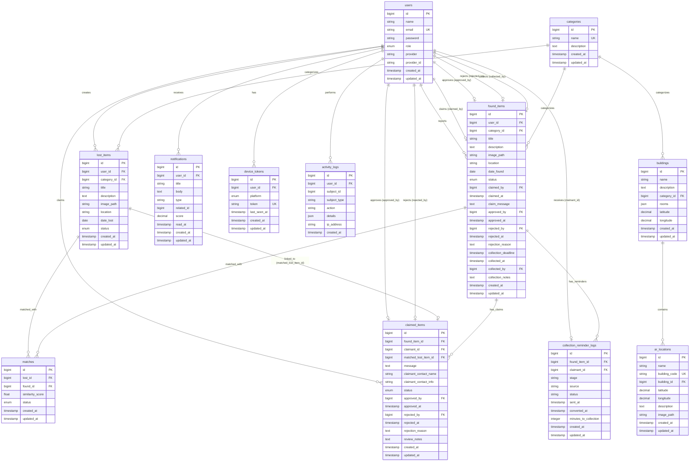

# Entity Relationship Diagram (ERD)
## NavistFind: An AI-Powered Lost and Found with Augmented Reality-Based Campus Navigation System

---

## Introduction

This document provides a comprehensive Entity Relationship Diagram (ERD) for the NavistFind system database. The ERD illustrates all entities, their attributes, primary keys (PK), foreign keys (FK), and the relationships between them with cardinalities.

The database is designed to support:
- User management and authentication
- Lost and found item management
- AI-powered item matching
- Claim processing and approval workflow
- Notification system (push, email, in-app)
- AR navigation and campus mapping
- Activity logging and analytics

---

## List of Entities

1. **users** - User accounts and authentication
2. **categories** - Item categories (e.g., Electronics, Clothing, Documents)
3. **buildings** - Campus building information
4. **lost_items** - Lost item records
5. **found_items** - Found item records
6. **matches** - AI-generated matches between lost and found items
7. **claimed_items** - Claim requests for found items
8. **notifications** - In-app notifications
9. **device_tokens** - Firebase Cloud Messaging (FCM) device tokens
10. **ar_locations** - AR navigation points of interest (POIs)
11. **activity_logs** - System activity tracking
12. **collection_reminder_logs** - Collection reminder tracking

---

## Entity Attributes

### 1. users

| Attribute | Type | Constraints | Description |
|-----------|------|-------------|-------------|
| **id** | BIGINT UNSIGNED | **PK**, AUTO_INCREMENT | User unique identifier |
| name | VARCHAR(255) | NOT NULL | User's full name |
| email | VARCHAR(255) | UNIQUE, NOT NULL | User's email address |
| email_verified_at | TIMESTAMP | NULLABLE | Email verification timestamp |
| password | VARCHAR(255) | NOT NULL | Hashed password |
| role | ENUM | DEFAULT 'student' | User role: student, admin, staff |
| provider | VARCHAR(255) | NULLABLE | OAuth provider (e.g., 'google') |
| provider_id | VARCHAR(255) | NULLABLE | OAuth provider user ID |
| remember_token | VARCHAR(100) | NULLABLE | Remember me token |
| created_at | TIMESTAMP | NULLABLE | Record creation timestamp |
| updated_at | TIMESTAMP | NULLABLE | Record update timestamp |

**Indexes**: `email` (unique)

---

### 2. categories

| Attribute | Type | Constraints | Description |
|-----------|------|-------------|-------------|
| **id** | BIGINT UNSIGNED | **PK**, AUTO_INCREMENT | Category unique identifier |
| name | VARCHAR(255) | UNIQUE, NOT NULL | Category name |
| description | TEXT | NULLABLE | Category description |
| created_at | TIMESTAMP | NULLABLE | Record creation timestamp |
| updated_at | TIMESTAMP | NULLABLE | Record update timestamp |

**Indexes**: `name` (unique)

---

### 3. buildings

| Attribute | Type | Constraints | Description |
|-----------|------|-------------|-------------|
| **id** | BIGINT UNSIGNED | **PK**, AUTO_INCREMENT | Building unique identifier |
| name | VARCHAR(255) | NOT NULL | Building name |
| description | TEXT | NULLABLE | Building description |
| **category_id** | BIGINT UNSIGNED | **FK** → categories.id, CASCADE DELETE | Building category |
| rooms | JSON | NULLABLE | Array of room names |
| latitude | DECIMAL(10,7) | NULLABLE | Building latitude coordinate |
| longitude | DECIMAL(10,7) | NULLABLE | Building longitude coordinate |
| created_at | TIMESTAMP | NULLABLE | Record creation timestamp |
| updated_at | TIMESTAMP | NULLABLE | Record update timestamp |

**Foreign Keys**: 
- `category_id` → `categories.id` (ON DELETE CASCADE)

---

### 4. lost_items

| Attribute | Type | Constraints | Description |
|-----------|------|-------------|-------------|
| **id** | BIGINT UNSIGNED | **PK**, AUTO_INCREMENT | Lost item unique identifier |
| **user_id** | BIGINT UNSIGNED | **FK** → users.id, CASCADE DELETE | User who reported the lost item |
| **category_id** | BIGINT UNSIGNED | **FK** → categories.id, RESTRICT DELETE | Item category |
| title | VARCHAR(255) | NOT NULL | Item title |
| description | TEXT | NULLABLE | Item description |
| image_path | VARCHAR(255) | NULLABLE | Path to item image |
| location | VARCHAR(255) | NULLABLE | Location where item was lost |
| date_lost | DATE | NULLABLE | Date when item was lost |
| status | ENUM | DEFAULT 'open' | Status: open, matched, closed |
| created_at | TIMESTAMP | NULLABLE | Record creation timestamp |
| updated_at | TIMESTAMP | NULLABLE | Record update timestamp |

**Foreign Keys**: 
- `user_id` → `users.id` (ON DELETE CASCADE)
- `category_id` → `categories.id` (ON DELETE RESTRICT)

**Indexes**: 
- `user_id`
- `category_id`
- `status`
- `date_lost`
- `created_at`
- Full-text: `title`, `description`

---

### 5. found_items

| Attribute | Type | Constraints | Description |
|-----------|------|-------------|-------------|
| **id** | BIGINT UNSIGNED | **PK**, AUTO_INCREMENT | Found item unique identifier |
| **user_id** | BIGINT UNSIGNED | **FK** → users.id, NULL ON DELETE | User who reported the found item (nullable for admin-created items) |
| **category_id** | BIGINT UNSIGNED | **FK** → categories.id, RESTRICT DELETE | Item category |
| title | VARCHAR(255) | NOT NULL | Item title |
| description | TEXT | NULLABLE | Item description |
| image_path | VARCHAR(255) | NULLABLE | Path to item image |
| location | VARCHAR(255) | NULLABLE | Location where item was found |
| date_found | DATE | NULLABLE | Date when item was found |
| status | ENUM | DEFAULT 'unclaimed' | Status: unclaimed, matched, returned, claim_pending, claim_approved, collected |
| **claimed_by** | BIGINT UNSIGNED | **FK** → users.id, NULL ON DELETE | User who claimed the item |
| claimed_at | TIMESTAMP | NULLABLE | Timestamp when item was claimed |
| claim_message | TEXT | NULLABLE | Claim message from claimant |
| **approved_by** | BIGINT UNSIGNED | **FK** → users.id, NULL ON DELETE | Admin who approved the claim |
| approved_at | TIMESTAMP | NULLABLE | Timestamp when claim was approved |
| **rejected_by** | BIGINT UNSIGNED | **FK** → users.id, NULL ON DELETE | Admin who rejected the claim |
| rejected_at | TIMESTAMP | NULLABLE | Timestamp when claim was rejected |
| rejection_reason | TEXT | NULLABLE | Reason for rejection |
| collection_deadline | TIMESTAMP | NULLABLE | Deadline for item collection |
| last_collection_reminder_at | TIMESTAMP | NULLABLE | Last collection reminder timestamp |
| collection_reminder_stage | VARCHAR(255) | NULLABLE | Current reminder stage |
| overdue_notified_at | TIMESTAMP | NULLABLE | Overdue notification timestamp |
| pending_sla_notified_at | TIMESTAMP | NULLABLE | Pending claim SLA notification timestamp |
| collected_at | TIMESTAMP | NULLABLE | Timestamp when item was collected |
| **collected_by** | BIGINT UNSIGNED | **FK** → users.id, NULL ON DELETE | User who collected the item |
| collection_notes | TEXT | NULLABLE | Notes about collection |
| version | INTEGER | DEFAULT 1 | Version number for optimistic locking |
| created_at | TIMESTAMP | NULLABLE | Record creation timestamp |
| updated_at | TIMESTAMP | NULLABLE | Record update timestamp |

**Foreign Keys**: 
- `user_id` → `users.id` (ON DELETE SET NULL)
- `category_id` → `categories.id` (ON DELETE RESTRICT)
- `claimed_by` → `users.id` (ON DELETE SET NULL)
- `approved_by` → `users.id` (ON DELETE SET NULL)
- `rejected_by` → `users.id` (ON DELETE SET NULL)
- `collected_by` → `users.id` (ON DELETE SET NULL)

**Indexes**: 
- `user_id`
- `category_id`
- `status`
- `date_found`
- `created_at`
- Full-text: `title`, `description`

---

### 6. matches

| Attribute | Type | Constraints | Description |
|-----------|------|-------------|-------------|
| **id** | BIGINT UNSIGNED | **PK**, AUTO_INCREMENT | Match unique identifier |
| **lost_id** | BIGINT UNSIGNED | **FK** → lost_items.id, CASCADE DELETE | Lost item ID |
| **found_id** | BIGINT UNSIGNED | **FK** → found_items.id, CASCADE DELETE | Found item ID |
| similarity_score | FLOAT | NOT NULL | AI similarity score (0.0 - 1.0) |
| status | ENUM | DEFAULT 'pending' | Match status: pending, confirmed, rejected |
| created_at | TIMESTAMP | NULLABLE | Record creation timestamp |
| updated_at | TIMESTAMP | NULLABLE | Record update timestamp |

**Foreign Keys**: 
- `lost_id` → `lost_items.id` (ON DELETE CASCADE)
- `found_id` → `found_items.id` (ON DELETE CASCADE)

**Indexes**: 
- `lost_id`
- `found_id`
- `status`
- Unique: `(lost_id, found_id)`

---

### 7. claimed_items

| Attribute | Type | Constraints | Description |
|-----------|------|-------------|-------------|
| **id** | BIGINT UNSIGNED | **PK**, AUTO_INCREMENT | Claim unique identifier |
| **found_item_id** | BIGINT UNSIGNED | **FK** → found_items.id, CASCADE DELETE | Found item being claimed |
| **claimant_id** | BIGINT UNSIGNED | **FK** → users.id, CASCADE DELETE | User making the claim |
| **matched_lost_item_id** | BIGINT UNSIGNED | **FK** → lost_items.id, NULL ON DELETE | Associated lost item (if matched) |
| message | TEXT | NULLABLE | Claim message |
| claimant_contact_name | VARCHAR(255) | NULLABLE | Claimant's contact name |
| claimant_contact_info | VARCHAR(255) | NULLABLE | Claimant's contact information |
| status | ENUM | DEFAULT 'pending' | Claim status: pending, approved, rejected, withdrawn |
| **approved_by** | BIGINT UNSIGNED | **FK** → users.id, NULL ON DELETE | Admin who approved the claim |
| approved_at | TIMESTAMP | NULLABLE | Approval timestamp |
| **rejected_by** | BIGINT UNSIGNED | **FK** → users.id, NULL ON DELETE | Admin who rejected the claim |
| rejected_at | TIMESTAMP | NULLABLE | Rejection timestamp |
| rejection_reason | TEXT | NULLABLE | Reason for rejection |
| review_notes | TEXT | NULLABLE | Admin review notes |
| created_at | TIMESTAMP | NULLABLE | Record creation timestamp |
| updated_at | TIMESTAMP | NULLABLE | Record update timestamp |

**Foreign Keys**: 
- `found_item_id` → `found_items.id` (ON DELETE CASCADE)
- `claimant_id` → `users.id` (ON DELETE CASCADE)
- `matched_lost_item_id` → `lost_items.id` (ON DELETE SET NULL)
- `approved_by` → `users.id` (ON DELETE SET NULL)
- `rejected_by` → `users.id` (ON DELETE SET NULL)

**Indexes**: 
- `(found_item_id, status)`

---

### 8. notifications

| Attribute | Type | Constraints | Description |
|-----------|------|-------------|-------------|
| **id** | BIGINT UNSIGNED | **PK**, AUTO_INCREMENT | Notification unique identifier |
| **user_id** | BIGINT UNSIGNED | **FK** → users.id, CASCADE DELETE | User receiving the notification |
| title | VARCHAR(255) | NOT NULL | Notification title |
| body | TEXT | NOT NULL | Notification message body |
| type | VARCHAR(255) | DEFAULT 'system_alert' | Notification type (e.g., matchFound, claimApproved, admin_message) |
| related_id | BIGINT UNSIGNED | NULLABLE | Related item/claim ID |
| score | DECIMAL(4,2) | NULLABLE | AI match score (for match notifications) |
| read_at | TIMESTAMP | NULLABLE | Timestamp when notification was read |
| created_at | TIMESTAMP | NULLABLE | Record creation timestamp |
| updated_at | TIMESTAMP | NULLABLE | Record update timestamp |

**Foreign Keys**: 
- `user_id` → `users.id` (ON DELETE CASCADE)

**Indexes**: 
- `user_id`
- `type`
- `created_at`
- `(user_id, read_at)`

---

### 9. device_tokens

| Attribute | Type | Constraints | Description |
|-----------|------|-------------|-------------|
| **id** | BIGINT UNSIGNED | **PK**, AUTO_INCREMENT | Device token unique identifier |
| **user_id** | BIGINT UNSIGNED | **FK** → users.id, CASCADE DELETE | User who owns the device |
| platform | ENUM | NOT NULL | Platform: android, ios, web |
| token | VARCHAR(2048) | UNIQUE, NOT NULL | FCM device token |
| last_seen_at | TIMESTAMP | NULLABLE | Last seen timestamp |
| created_at | TIMESTAMP | NULLABLE | Record creation timestamp |
| updated_at | TIMESTAMP | NULLABLE | Record update timestamp |

**Foreign Keys**: 
- `user_id` → `users.id` (ON DELETE CASCADE)

**Indexes**: 
- `user_id`
- `token` (unique)

---

### 10. ar_locations

| Attribute | Type | Constraints | Description |
|-----------|------|-------------|-------------|
| **id** | BIGINT UNSIGNED | **PK**, AUTO_INCREMENT | AR location unique identifier |
| name | VARCHAR(255) | NOT NULL | Location name |
| building_code | VARCHAR(255) | UNIQUE, NULLABLE | Building code |
| **building_id** | BIGINT UNSIGNED | **FK** → buildings.id, NULL ON DELETE | Associated building |
| latitude | DECIMAL(10,7) | NULLABLE | Location latitude coordinate |
| longitude | DECIMAL(10,7) | NULLABLE | Location longitude coordinate |
| description | TEXT | NULLABLE | Location description |
| image_path | VARCHAR(255) | NULLABLE | Path to location image |
| created_at | TIMESTAMP | NULLABLE | Record creation timestamp |
| updated_at | TIMESTAMP | NULLABLE | Record update timestamp |

**Foreign Keys**: 
- `building_id` → `buildings.id` (ON DELETE SET NULL)

**Indexes**: 
- `building_code` (unique)
- `building_id`
- `(latitude, longitude)`

---

### 11. activity_logs

| Attribute | Type | Constraints | Description |
|-----------|------|-------------|-------------|
| **id** | BIGINT UNSIGNED | **PK**, AUTO_INCREMENT | Activity log unique identifier |
| **user_id** | BIGINT UNSIGNED | **FK** → users.id, NULL ON DELETE | User who performed the action |
| subject_id | BIGINT UNSIGNED | NULLABLE | Polymorphic: ID of related entity |
| subject_type | VARCHAR(255) | NULLABLE | Polymorphic: Type of related entity (e.g., LostItem, FoundItem) |
| action | VARCHAR(255) | NOT NULL | Action performed |
| details | JSON | NULLABLE | Additional action details |
| ip_address | VARCHAR(45) | NULLABLE | IP address of the user |
| created_at | TIMESTAMP | NOT NULL | Action timestamp |

**Foreign Keys**: 
- `user_id` → `users.id` (ON DELETE SET NULL)

**Indexes**: 
- `user_id`
- `action`
- `created_at`
- `(subject_type, subject_id)`

**Note**: Uses polymorphic relationship for `subject_id` and `subject_type` to track activities on various entities.

---

### 12. collection_reminder_logs

| Attribute | Type | Constraints | Description |
|-----------|------|-------------|-------------|
| **id** | BIGINT UNSIGNED | **PK**, AUTO_INCREMENT | Reminder log unique identifier |
| **found_item_id** | BIGINT UNSIGNED | **FK** → found_items.id, CASCADE DELETE | Found item for which reminder was sent |
| **claimant_id** | BIGINT UNSIGNED | **FK** → users.id, NULL ON DELETE | Claimant who received the reminder |
| stage | VARCHAR(255) | NULLABLE | Reminder stage (e.g., first, second, final) |
| source | VARCHAR(255) | DEFAULT 'auto' | Source: auto (scheduled) or manual |
| status | VARCHAR(255) | DEFAULT 'pending' | Status: pending, converted, expired |
| sent_at | TIMESTAMP | NOT NULL | Timestamp when reminder was sent |
| converted_at | TIMESTAMP | NULLABLE | Timestamp when reminder was converted (item collected) |
| minutes_to_collection | INTEGER | NULLABLE | Minutes until collection deadline when reminder was sent |
| created_at | TIMESTAMP | NULLABLE | Record creation timestamp |
| updated_at | TIMESTAMP | NULLABLE | Record update timestamp |

**Foreign Keys**: 
- `found_item_id` → `found_items.id` (ON DELETE CASCADE)
- `claimant_id` → `users.id` (ON DELETE SET NULL)

**Indexes**: 
- `(found_item_id, sent_at)`

---

## Entity Relationship Diagram (ERD)

### Mermaid ERD Format

---

## Relationship Explanations

### 1. users ↔ lost_items (1:N)
- **Cardinality**: One user can create many lost items
- **Relationship**: A user reports lost items they've lost
- **Foreign Key**: `lost_items.user_id` → `users.id`
- **Delete Rule**: CASCADE (if user is deleted, their lost items are deleted)

### 2. users ↔ found_items (1:N)
- **Cardinality**: One user can report many found items
- **Relationship**: A user reports items they've found
- **Foreign Key**: `found_items.user_id` → `users.id`
- **Delete Rule**: SET NULL (found items can exist without a user if created by admin)

### 3. users ↔ found_items (1:N) - Claimed By
- **Cardinality**: One user can claim many found items
- **Relationship**: A user claims found items
- **Foreign Key**: `found_items.claimed_by` → `users.id`
- **Delete Rule**: SET NULL

### 4. users ↔ found_items (1:N) - Approved By
- **Cardinality**: One admin can approve many found items
- **Relationship**: An admin approves claim requests
- **Foreign Key**: `found_items.approved_by` → `users.id`
- **Delete Rule**: SET NULL

### 5. users ↔ found_items (1:N) - Rejected By
- **Cardinality**: One admin can reject many found items
- **Relationship**: An admin rejects claim requests
- **Foreign Key**: `found_items.rejected_by` → `users.id`
- **Delete Rule**: SET NULL

### 6. users ↔ found_items (1:N) - Collected By
- **Cardinality**: One user can collect many found items
- **Relationship**: A user collects approved found items
- **Foreign Key**: `found_items.collected_by` → `users.id`
- **Delete Rule**: SET NULL

### 7. users ↔ claimed_items (1:N)
- **Cardinality**: One user can make many claim requests
- **Relationship**: A user submits claims for found items
- **Foreign Key**: `claimed_items.claimant_id` → `users.id`
- **Delete Rule**: CASCADE

### 8. users ↔ claimed_items (1:N) - Approved By
- **Cardinality**: One admin can approve many claims
- **Relationship**: An admin approves claim requests
- **Foreign Key**: `claimed_items.approved_by` → `users.id`
- **Delete Rule**: SET NULL

### 9. users ↔ claimed_items (1:N) - Rejected By
- **Cardinality**: One admin can reject many claims
- **Relationship**: An admin rejects claim requests
- **Foreign Key**: `claimed_items.rejected_by` → `users.id`
- **Delete Rule**: SET NULL

### 10. users ↔ notifications (1:N)
- **Cardinality**: One user can receive many notifications
- **Relationship**: A user receives in-app notifications
- **Foreign Key**: `notifications.user_id` → `users.id`
- **Delete Rule**: CASCADE

### 11. users ↔ device_tokens (1:N)
- **Cardinality**: One user can have many device tokens (multiple devices)
- **Relationship**: A user registers FCM tokens for push notifications
- **Foreign Key**: `device_tokens.user_id` → `users.id`
- **Delete Rule**: CASCADE

### 12. users ↔ activity_logs (1:N)
- **Cardinality**: One user can perform many activities
- **Relationship**: A user's actions are logged
- **Foreign Key**: `activity_logs.user_id` → `users.id`
- **Delete Rule**: SET NULL (logs can exist without user for system actions)

### 13. users ↔ collection_reminder_logs (1:N)
- **Cardinality**: One user (claimant) can receive many reminders
- **Relationship**: A claimant receives collection reminders
- **Foreign Key**: `collection_reminder_logs.claimant_id` → `users.id`
- **Delete Rule**: SET NULL

### 14. categories ↔ lost_items (1:N)
- **Cardinality**: One category can have many lost items
- **Relationship**: Lost items are categorized
- **Foreign Key**: `lost_items.category_id` → `categories.id`
- **Delete Rule**: RESTRICT (cannot delete category if items exist)

### 15. categories ↔ found_items (1:N)
- **Cardinality**: One category can have many found items
- **Relationship**: Found items are categorized
- **Foreign Key**: `found_items.category_id` → `categories.id`
- **Delete Rule**: RESTRICT

### 16. categories ↔ buildings (1:N)
- **Cardinality**: One category can have many buildings
- **Relationship**: Buildings are categorized
- **Foreign Key**: `buildings.category_id` → `categories.id`
- **Delete Rule**: CASCADE

### 17. buildings ↔ ar_locations (1:N)
- **Cardinality**: One building can have many AR locations
- **Relationship**: AR locations are associated with buildings
- **Foreign Key**: `ar_locations.building_id` → `buildings.id`
- **Delete Rule**: SET NULL

### 18. lost_items ↔ matches (1:N)
- **Cardinality**: One lost item can have many matches
- **Relationship**: A lost item can be matched with multiple found items
- **Foreign Key**: `matches.lost_id` → `lost_items.id`
- **Delete Rule**: CASCADE

### 19. found_items ↔ matches (1:N)
- **Cardinality**: One found item can have many matches
- **Relationship**: A found item can be matched with multiple lost items
- **Foreign Key**: `matches.found_id` → `found_items.id`
- **Delete Rule**: CASCADE

### 20. lost_items ↔ found_items (M:N via matches)
- **Cardinality**: Many-to-many relationship
- **Relationship**: Lost items and found items are matched via the `matches` table
- **Implementation**: Junction table `matches` with `lost_id` and `found_id`
- **Unique Constraint**: `(lost_id, found_id)` ensures one match per pair

### 21. found_items ↔ claimed_items (1:N)
- **Cardinality**: One found item can have many claim requests
- **Relationship**: A found item can receive multiple claim requests
- **Foreign Key**: `claimed_items.found_item_id` → `found_items.id`
- **Delete Rule**: CASCADE

### 22. lost_items ↔ claimed_items (1:N)
- **Cardinality**: One lost item can be linked to many claims
- **Relationship**: A lost item can be associated with multiple claims (if matched)
- **Foreign Key**: `claimed_items.matched_lost_item_id` → `lost_items.id`
- **Delete Rule**: SET NULL

### 23. found_items ↔ collection_reminder_logs (1:N)
- **Cardinality**: One found item can have many reminder logs
- **Relationship**: A found item can have multiple collection reminders sent
- **Foreign Key**: `collection_reminder_logs.found_item_id` → `found_items.id`
- **Delete Rule**: CASCADE

### 24. activity_logs ↔ Various Entities (Polymorphic)
- **Cardinality**: One-to-many (polymorphic)
- **Relationship**: Activity logs can track activities on various entities (LostItem, FoundItem, etc.)
- **Implementation**: Uses `subject_id` and `subject_type` for polymorphic relationship
- **Delete Rule**: N/A (polymorphic, no direct FK constraint)

---

## Cardinality Summary

| Relationship | Cardinality | Type |
|--------------|-------------|------|
| users → lost_items | 1:N | One-to-Many |
| users → found_items | 1:N | One-to-Many |
| users → claimed_items | 1:N | One-to-Many |
| users → notifications | 1:N | One-to-Many |
| users → device_tokens | 1:N | One-to-Many |
| users → activity_logs | 1:N | One-to-Many |
| users → collection_reminder_logs | 1:N | One-to-Many |
| categories → lost_items | 1:N | One-to-Many |
| categories → found_items | 1:N | One-to-Many |
| categories → buildings | 1:N | One-to-Many |
| buildings → ar_locations | 1:N | One-to-Many |
| lost_items → matches | 1:N | One-to-Many |
| found_items → matches | 1:N | One-to-Many |
| lost_items ↔ found_items | M:N | Many-to-Many (via matches) |
| found_items → claimed_items | 1:N | One-to-Many |
| lost_items → claimed_items | 1:N | One-to-Many |
| found_items → collection_reminder_logs | 1:N | One-to-Many |
| activity_logs → entities | 1:N | Polymorphic One-to-Many |

---

## Key Design Decisions

### 1. Soft Deletes for Found Items
- Found items use `SET NULL` for user relationships to allow admin-created items
- This ensures found items can exist even if the reporting user is deleted

### 2. Cascade Deletes for User Content
- Lost items, notifications, and device tokens are deleted when a user is deleted
- This maintains data integrity and privacy

### 3. Restrict Deletes for Categories
- Categories cannot be deleted if items exist (RESTRICT)
- This prevents orphaned items and maintains data consistency

### 4. Polymorphic Activity Logs
- Activity logs use polymorphic relationships to track activities on various entities
- This provides flexible auditing without creating multiple log tables

### 5. Multiple User Relationships in Found Items
- Found items have multiple user relationships (user_id, claimed_by, approved_by, rejected_by, collected_by)
- This tracks the complete lifecycle of a found item through different users

### 6. Junction Table for Matches
- The `matches` table serves as a junction table for the many-to-many relationship between lost and found items
- Unique constraint ensures one match per lost-found pair

### 7. Collection Reminder Tracking
- Separate `collection_reminder_logs` table tracks all reminder attempts
- This enables analytics and prevents duplicate reminders

---

## Indexes Summary

### Primary Indexes (PK)
- All tables have `id` as primary key

### Foreign Key Indexes
- All foreign key columns are indexed for join performance

### Unique Indexes
- `users.email`
- `categories.name`
- `device_tokens.token`
- `ar_locations.building_code`
- `matches(lost_id, found_id)` - composite unique

### Composite Indexes
- `notifications(user_id, read_at)`
- `collection_reminder_logs(found_item_id, sent_at)`
- `activity_logs(subject_type, subject_id)`

### Full-Text Indexes
- `lost_items(title, description)`
- `found_items(title, description)`

### Performance Indexes
- Status columns (`lost_items.status`, `found_items.status`, `matches.status`, `claimed_items.status`)
- Date columns (`lost_items.date_lost`, `found_items.date_found`)
- Timestamp columns (`created_at`, `updated_at`)

---

## Database Constraints

### Check Constraints
- `users.role` must be one of: student, admin, staff
- `lost_items.status` must be one of: open, matched, closed
- `found_items.status` must be one of: unclaimed, matched, returned, claim_pending, claim_approved, collected
- `matches.status` must be one of: pending, confirmed, rejected
- `claimed_items.status` must be one of: pending, approved, rejected, withdrawn
- `device_tokens.platform` must be one of: android, ios, web

### Not Null Constraints
- All primary keys
- `users.name`, `users.email`, `users.password`
- `categories.name`
- `lost_items.title`, `lost_items.user_id`, `lost_items.category_id`
- `found_items.title`, `found_items.category_id`
- `matches.lost_id`, `matches.found_id`, `matches.similarity_score`
- `claimed_items.found_item_id`, `claimed_items.claimant_id`
- `notifications.user_id`, `notifications.title`, `notifications.body`
- `device_tokens.user_id`, `device_tokens.platform`, `device_tokens.token`
- `activity_logs.action`, `activity_logs.created_at`

---

## Notes

1. **Polymorphic Relationships**: The `activity_logs` table uses polymorphic relationships (`subject_id`, `subject_type`) to track activities on various entities without creating separate log tables.

2. **Status Enums**: Multiple tables use ENUM types for status fields. These should be consistent with the application's enum classes (`LostItemStatus`, `FoundItemStatus`, `ClaimStatus`).

3. **Soft Deletes**: While not shown in the schema, the application may implement soft deletes for certain entities. Check the model classes for `SoftDeletes` trait usage.

4. **Timestamps**: All tables (except `activity_logs`) have `created_at` and `updated_at` timestamps managed by Laravel's Eloquent ORM.

5. **JSON Fields**: The `buildings.rooms` field stores an array of room names as JSON, and `activity_logs.details` stores additional action details as JSON.

6. **Decimal Precision**: Coordinates use `DECIMAL(10,7)` for latitude/longitude, providing sufficient precision for GPS coordinates.

7. **Token Length**: `device_tokens.token` is `VARCHAR(2048)` to accommodate long FCM tokens.

---

**Document Version**: 1.0  
**Last Updated**: 2025-01-XX  
**Database Engine**: MySQL (InnoDB)  
**Related Documents**: `SYSTEM_ARCHITECTURE_OVERVIEW.md`, `LEVEL_1_DATA_FLOW_DIAGRAM.md`

