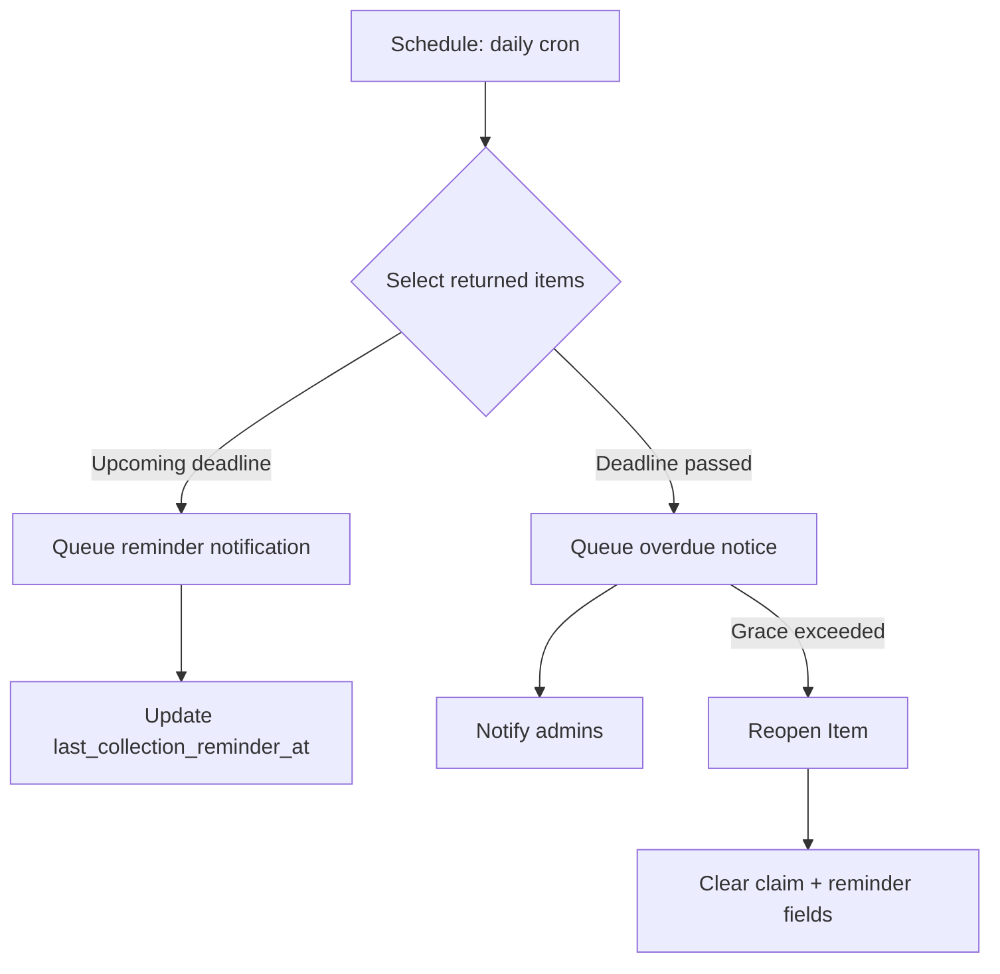

# Collection Reminder Workflow Draft

## Reminder Timing & Channels
- **Primary schedule**: trigger reminders 3 days and 1 day before `collection_deadline`.
- **Overdue sweep**: run daily to flag items past deadline and notify admins.
- **Channels**: in-app push via `SendNotificationJob`, optional email/SMS once messaging service is ready.

## Reminder Logic
- Target `FoundItem` rows with `status = 'CLAIM_APPROVED'`, `collected_at = null`, and `collection_deadline` set.
- Skip items already flagged as overdue and recently reminded (add `last_collection_reminder_at` column or use job logs to prevent spam).
- Include collection instructions (location, hours, contact) using config from `services.admin_office`.

- When `collection_deadline` < `now()` and `collected_at` is still null:
  - Send claimant an "overdue" notice with escalation steps.
  - Notify admins (push + highlight in dashboard) for manual follow-up.
  - Optionally reopen the item (set `status` back to `FOUND_UNCLAIMED`) after a configurable grace period (e.g., 3 days overdue) and clear claim metadata.

## Data Additions
- New columns on `found_items`:
  - `last_collection_reminder_at` (datetime, nullable) to avoid duplicate reminders.
  - `overdue_notified_at` (datetime, nullable) to track admin escalations.
- Consider `collection_status` enum (`pending`, `reminded`, `overdue`, `reopened`) if we want explicit workflow state.

## Job/Command Flow

## Admin Dashboard Updates
- Add "Overdue for pickup" badge using `isCollectionDeadlinePassed()`.
- Provide manual "Send reminder" button to trigger job for a specific item.
- Show reminder history (dates, channel) in claim detail modal.

## Safeguards & Edge Cases
- Skip reminders for items linked to scheduled pickup appointments (future enhancement).
- Allow admin override to suppress reminders if claimant contacted offline.
- Ensure queue job is idempotent; lock rows or use optimistic updates when reopening items.

## Configuration & Scheduling
- Environment overrides:
  - `COLLECTION_FIRST_REMINDER_HOURS` (default `72`)
  - `COLLECTION_SECOND_REMINDER_HOURS` (default `24`)
  - `COLLECTION_REMINDER_COOLDOWN_HOURS` (default `12`)
  - `COLLECTION_GRACE_HOURS` (default `72`)
- Scheduler (`app/Console/Kernel.php`):
  - `app:sync-claimed-items` → `hourly()`
  - `ProcessOverdueCollectionsJob` → `dailyAt('22:30')`

